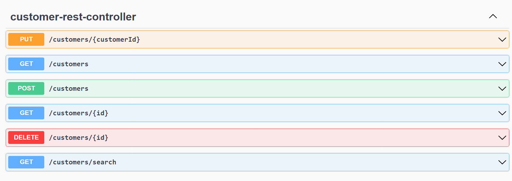
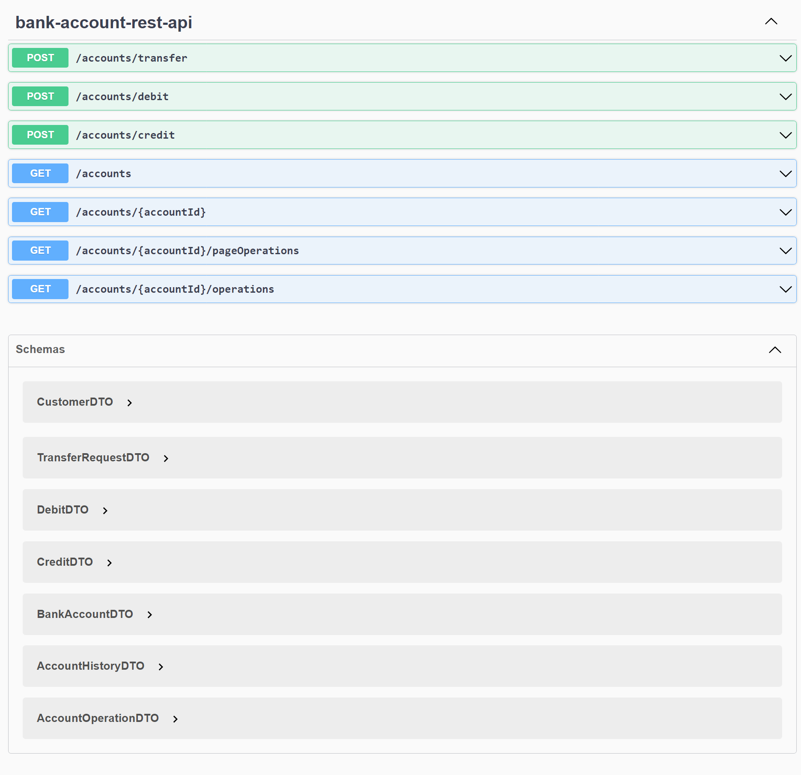
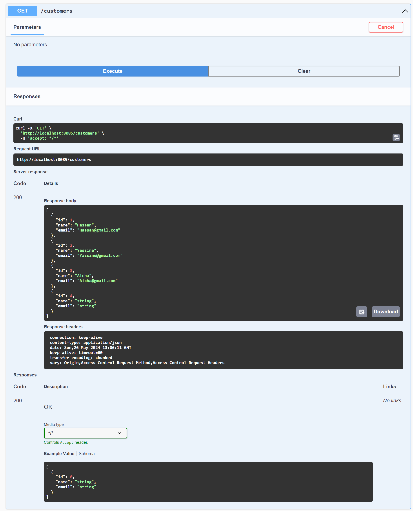
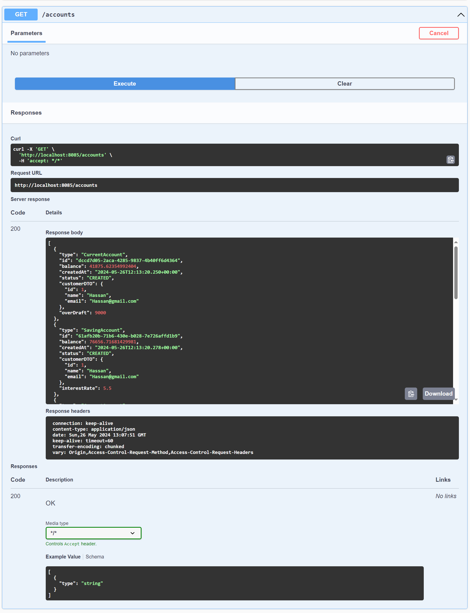

<h1>
Projet Spring Angular JWT
</h1>

On souhaite créer une application qui permet de gérer des comptes bancaires. 
chaque compte appartient à un client. un compte peut subir plusieurs opérations
de type DEBIT ou CREDIT. Il existe deux types de comptes : Comptes courants et
comptes épargnes.

Les entités JPA :   Customer, BankAccount, Saving Account, CurrentAccount, AccountOperation

Teste de web services Restful :

Afficher tous les clients : 

Afficher tous les comptes  : 

